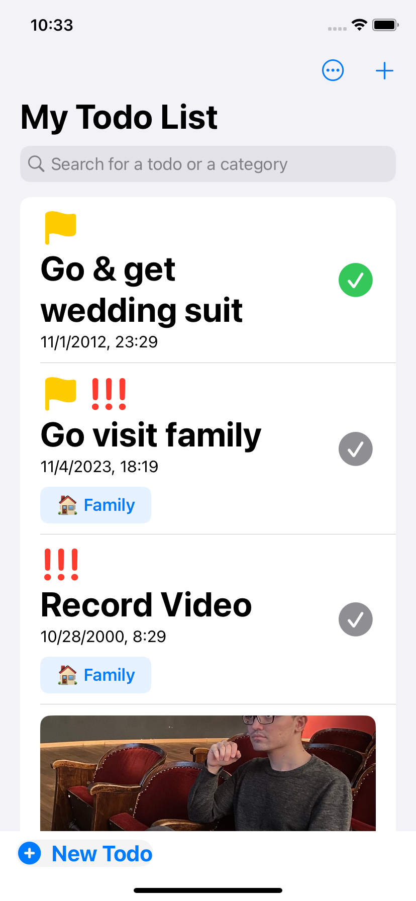
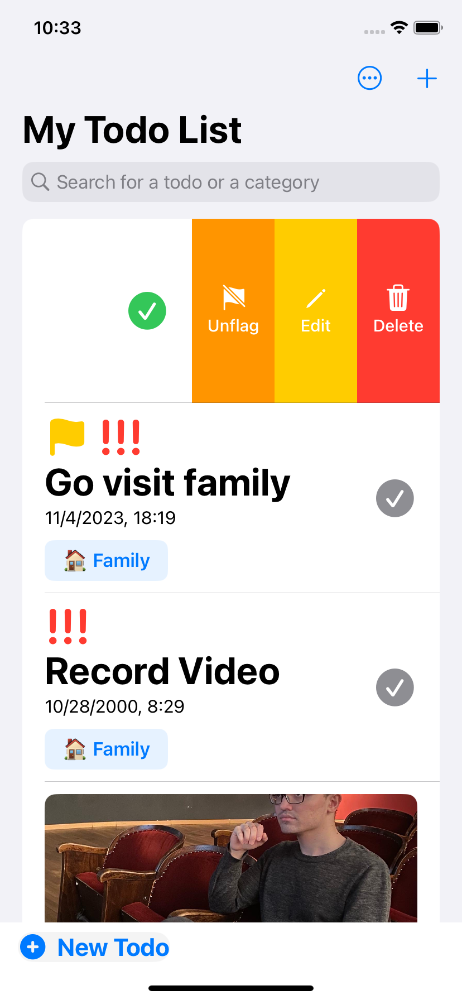
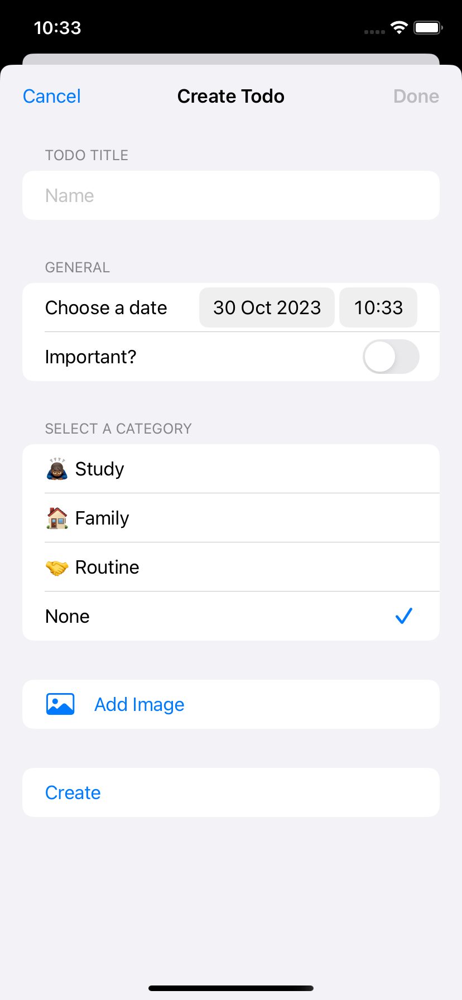
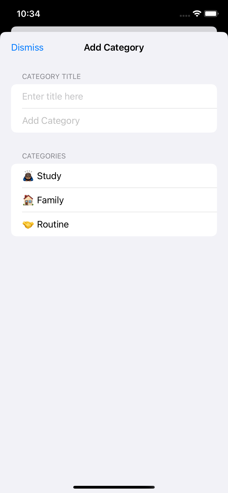
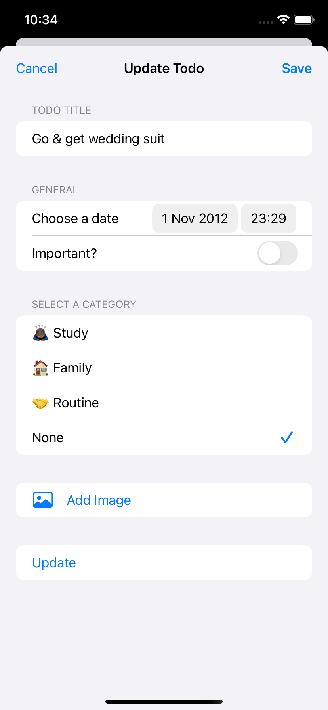

# ToDo App (built with SwiftData)

<p>
  
  
  
  
  
</p>

## About the Project

This simple ToDo application has been developed using the Swift programming language and the SwiftData database. The purpose of this project is learning and testing SwiftData.

## Technologies Used

`Swift`
`SwiftData`

## Installation

1. Clone this repository or download it as a zip file:

```
git clone tps://github.com/denaktepe/todo-app-swiftdata.git
```

2. Navigate to the project folder and run the following command to install the necessary dependencies:

```
pod install
```

3. Open Xcode and open the TodoApp.xcworkspace file.

4. Build the project in Xcode and optionally run it on an iOS device or simulator.

## Contributions

If you would like to contribute to this project, please follow these steps:

1. Fork this repository to your GitHub account.
2. Create a new branch: `git checkout -b my-feature`
3. Make your changes and commit them: `git commit -m "A descriptive commit message"`
4. Push your changes: `git push origin my-feature`
5. Open a pull request and share your changes.

## Contact

For any questions, suggestions, or feedback, please email me at sametcagriaktepe@gmail.com.


